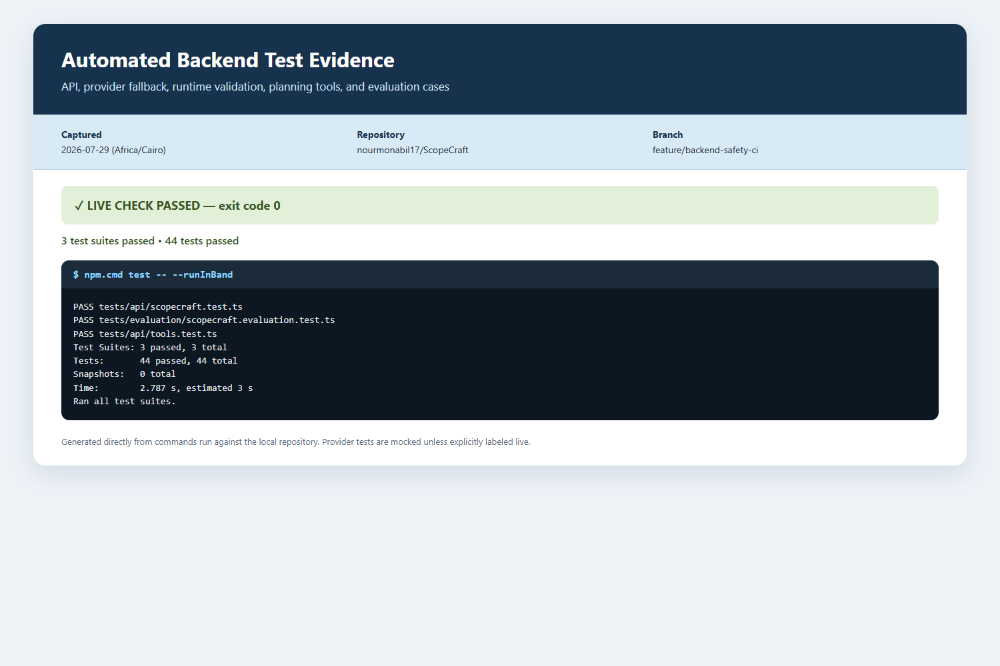
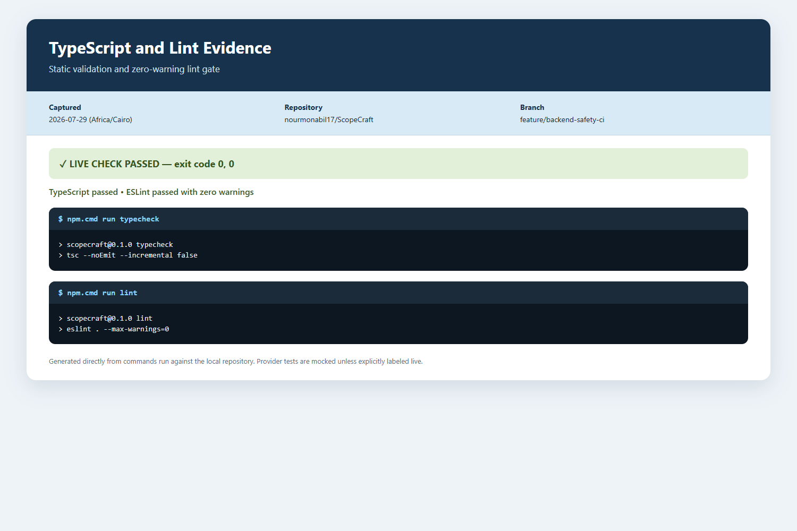
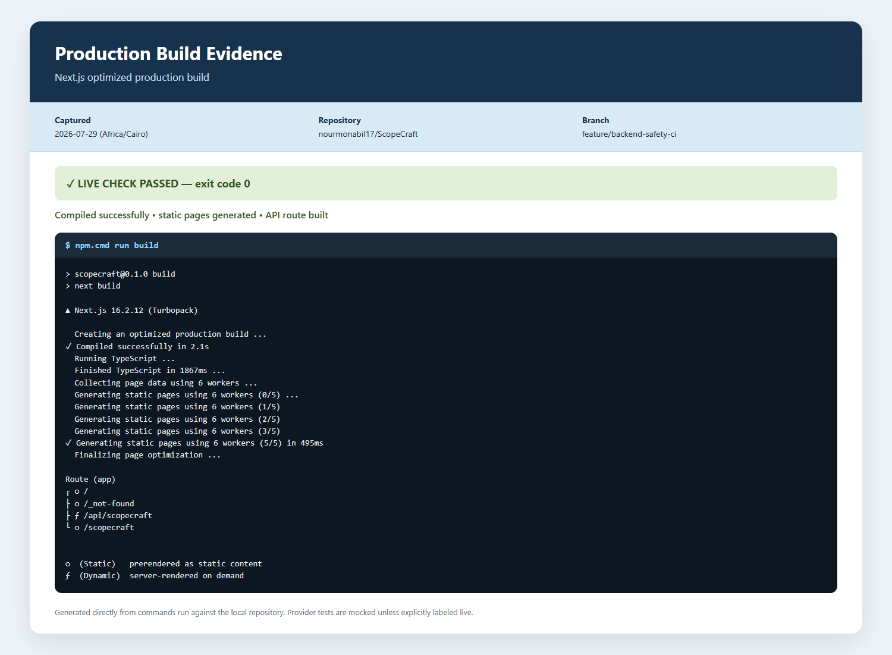
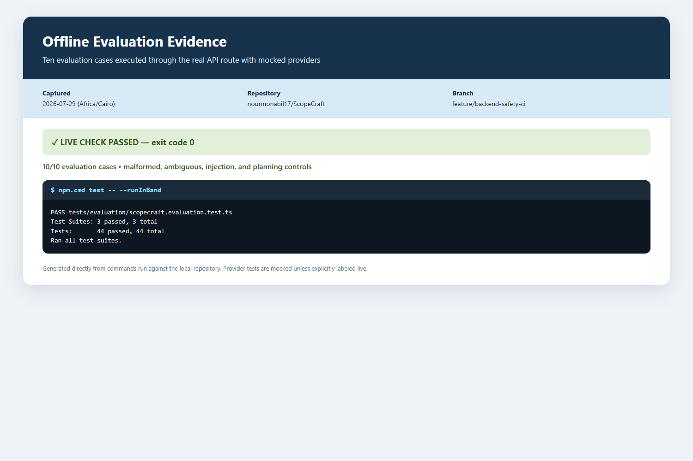
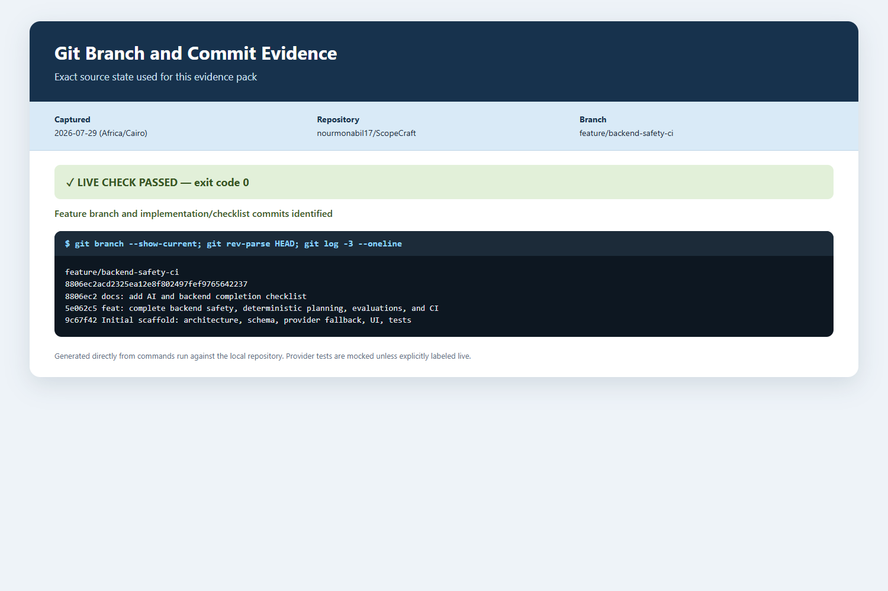

# ScopeCraft AI & Backend Evidence Record

Prepared: 2026-07-29  
Repository: https://github.com/nourmonabil17/ScopeCraft  
Feature branch: `feature/backend-safety-ci`  
Implementation commit: `5e062c5`  
Checklist commit: `8806ec2`

## Evidence status legend

- **Verified** — implementation exists and was covered by an automated check or a successful build/type/lint check.
- **Verified with mocks** — provider behavior was tested without real Gemini or Groq credentials.
- **Documented** — the supporting project document exists in the committed Git history.
- **Not yet verified** — live-provider, deployed-production, grounding, or final-presentation evidence is still required.

## Current verification result

The following commands were rerun locally on 2026-07-29:

| Check | Result |
|---|---|
| `npm test -- --runInBand` | **Passed — 3 suites, 44 tests** |
| `npm run typecheck` | **Passed** |
| `npm run lint` | **Passed with zero warnings** |
| `npm run build` | **Passed — production application compiled and all pages generated** |

The production dependency audit was previously executed and recorded as zero
known production vulnerabilities in commit `5e062c5`. It could not be rerun
during this evidence pass because the npm audit endpoint was unavailable.

## Live verification screenshots

### Automated tests — 44/44 passed

### TypeScript and lint checks

### Production build

### Offline evaluation suite

### Git branch and commit identity

## Session 1 — Backend foundation

| Completed check | Status | Evidence |
|---|---|---|
| Confirm the baseline runs locally | Verified | Dependencies are installed; tests, type-check, lint, and production build run successfully. |
| Understand the browser → route → validation → provider → response flow | Verified | `src/app/scopecraft/page.tsx`, `src/app/api/scopecraft/route.ts`, `src/lib/scopecraft/schema.ts`, `src/lib/scopecraft/service.ts`, and `src/lib/ai/providers.ts`. |
| Convert the required fields into typed schemas | Verified | Request/response types and runtime validators in `src/lib/scopecraft/schema.ts`. |
| Prepare valid and invalid request/response examples | Verified | `tests/fixtures/scopecraft/sample-response.json`, API test fixtures in `tests/api/scopecraft.test.ts`, and evaluation fixtures in `tests/evaluation/scopecraft-cases.json`. |
| Build the validated backend Route Handler | Verified | `src/app/api/scopecraft/route.ts`; exercised through the real exported `POST` handler in `tests/api/scopecraft.test.ts`. |
| Validate incoming requests | Verified | `parseScopeCraftRequest()` in `src/lib/scopecraft/schema.ts`; invalid requests tested before provider invocation. |
| Validate AI-generated responses at runtime | Verified | `parseScopeCraftResponse()` and `safeParseModelJSON()`; invalid provider responses are rejected in API tests. |
| Add the first normal and failure API cases | Verified | Expanded into `tests/api/scopecraft.test.ts`; included in the 44 passing tests. |
| Keep provider keys server-side | Verified by design | Keys are read only in `src/lib/ai/providers.ts`; `.env.example` contains names only, not secret values. |

## Session 2 — AI providers and structured output

| Completed check | Status | Evidence |
|---|---|---|
| Implement the Gemini provider adapter | Verified with mocks | `geminiProvider` in `src/lib/ai/providers.ts`; missing-key and provider behavior covered by tests. |
| Implement the Groq provider adapter | Verified with mocks | `groqProvider` in `src/lib/ai/providers.ts`; missing-key and fallback behavior covered by tests. |
| Implement provider abstraction and fallback | Verified with mocks | `generateWithFallback()` in `src/lib/ai/providers.ts`; Gemini failure → Groq success and both-provider failure are tested. |
| Produce structured AI output | Verified | JSON prompt contract and runtime response validation in `src/lib/ai/providers.ts` and `src/lib/scopecraft/schema.ts`. |
| Reject malformed AI output | Verified | Non-JSON and schema-invalid responses are rejected by API/evaluation tests. |
| Add prompt injection safeguards | Verified | The prompt delimits user input as untrusted; cases 9 and 10 in `tests/evaluation/scopecraft.evaluation.test.ts`. |
| Add prompt versioning | Verified | `PROMPT_VERSION = "v2"`; returned internally and through `X-Prompt-Version`; asserted in evaluation tests. |
| Add missing API-key handling | Verified | Missing `GEMINI_API_KEY` and `GROQ_API_KEY` cases in `tests/api/scopecraft.test.ts`. |
| Add structured response and provider tests | Verified | Provider/API cases in `tests/api/scopecraft.test.ts`; all included in the 44 passing tests. |

> Provider verification is offline and mocked. This evidence does **not** claim
> successful live Gemini or Groq calls.

## Session 3 — Deterministic tools and sprint planning

| Completed check | Status | Evidence |
|---|---|---|
| Implement deterministic priority calculation | Verified | `priorityScore()` in `src/lib/scopecraft/tools.ts`; tests in `tests/api/tools.test.ts`. |
| Use validated value, risk, and effort inputs | Verified | Schema fields in `src/lib/scopecraft/schema.ts`; boundary tests in `tests/api/tools.test.ts`. |
| Replace the hardcoded risk value | Verified | Each story supplies validated `value`, `risk`, and `effort`; service maps them into scoring inputs. |
| Recalculate the top-level priority map | Verified | `runScopeCraft()` in `src/lib/scopecraft/service.ts` rebuilds priority from deterministic sprint results. |
| Keep top-level and sprint scores consistent | Verified | API test asserts `body.priority[story_id] === story.priority_score`. |
| Make sprint capacity configurable | Verified | `capacity_per_sprint` request field, validated range, UI input, default profile, and API tests. |
| Prevent a sprint from exceeding capacity | Verified | `planSprint()` in `src/lib/scopecraft/tools.ts`; capacity tests in `tests/api/tools.test.ts`. |
| Implement dependency-aware planning | Verified | Dependency scheduling in `planSprint()`; dependency-order test in `tests/api/tools.test.ts`. |
| Reject missing dependencies | Verified | Missing dependency test in `tests/api/tools.test.ts`. |
| Reject circular dependencies | Verified | Cycle detection and test in `tests/api/tools.test.ts`. |
| Validate deterministic tool arguments | Verified | Range/integer/effort/capacity checks in schema and tool functions; negative tests pass. |

### Session 3 work still open

- Connect the backend to the team-approved bounded source register and templates.
- Implement the final grounded retrieval interface and source metadata.
- Add the final not-found/tool-failure evidence after grounding is connected.
- Document normal, not-found, and tool-failure grounding behavior.

## Session 4 — Safety, evaluation, CI, and production readiness

| Completed check | Status | Evidence |
|---|---|---|
| Add a 10-second provider timeout | Verified with mocks | `PROVIDER_TIMEOUT_MS = 10_000`, `AbortController`, and timeout test. |
| Add request cancellation | Verified with mocks | Abort signal passed to provider fetches in `src/lib/ai/providers.ts`. |
| Return safe 400 invalid-request responses | Verified | Route validation tests in `tests/api/scopecraft.test.ts`. |
| Return safe 422 malformed-output/clarification responses | Verified | Malformed output and ambiguous-input tests. |
| Return safe 502 provider-failure responses | Verified with mocks | Both-provider failure route test. |
| Return safe 504 timeout responses | Verified with mocks | Fallback timeout route test. |
| Prevent invalid requests from calling providers | Verified | Provider spies remain uncalled for invalid input/capacity cases. |
| Execute the evaluation set | Verified with mocks | `tests/evaluation/scopecraft-cases.json`; 10 of 10 cases reported in `tests/evaluation/report.md`. |
| Test ambiguous input | Verified | Case 6 returns `CLARIFICATION_REQUIRED` without contacting a provider. |
| Test prompt injection and malformed output | Verified | Cases 9 and 10 in the evaluation suite. |
| Add API regression tests | Verified | Three passing suites and 44 passing tests. |
| Add TypeScript validation | Verified | `npm run typecheck` passed. |
| Add lint validation | Verified | `npm run lint` passed with zero warnings. |
| Add production build validation | Verified | `npm run build` passed locally and the CI workflow includes the build. |
| Add GitHub Actions CI | Verified | `.github/workflows/ci.yml` runs install, tests, type-check, lint, and build for PRs to `main`/`dev`. |
| Upgrade production dependencies | Documented and verified by build | Next.js 16.2.12, React 19.2.0, and patched overrides recorded in `docs/security-review.md` in commit `5e062c5`. |
| Complete production dependency audit | Previously verified | Recorded result: zero known production vulnerabilities. |
| Update API and prompt documentation | Documented | `docs/api-contracts.md` and `docs/prompt-versions.md` in commit `5e062c5`. |
| Create the pull request and pass CI | Verified from GitHub review | PR #1 from `feature/backend-safety-ci` into `dev`; the submitted screenshot showed the CI check passing and the PR ready to merge. |

### Session 4 work still open

- Add the final maximum input/request-body limit decision.
- Review and sanitize production logging.
- Run live tests with protected Gemini and Groq credentials.
- Run final smoke tests after deployment.
- Document final backend/provider limitations.

## Session 5 — Final demonstration

Session 5 is not recorded as complete. The implementation provides evidence for
the presentation, but the presentation/demo itself still needs to happen.

The final defense should demonstrate:

- Backend architecture and data contracts.
- AI-generated fields versus deterministic scoring/planning.
- Mocked tests and, when available, live Gemini/Groq behavior.
- Fallback, timeout, invalid-input, and malformed-output handling.
- Priority, capacity, and dependency planning.
- Grounding/source behavior after Session 3 is completed.
- Known limitations.
- Test, build, CI, and pull-request evidence.

## Evidence locations

| Evidence | Location |
|---|---|
| Main API route | `src/app/api/scopecraft/route.ts` |
| Runtime schemas | `src/lib/scopecraft/schema.ts` |
| Provider adapters, timeout, fallback, prompt | `src/lib/ai/providers.ts` |
| Backend orchestration | `src/lib/scopecraft/service.ts` |
| Deterministic tools | `src/lib/scopecraft/tools.ts` |
| Tool rules | `src/lib/scopecraft/tool-rules.ts` |
| API/provider tests | `tests/api/scopecraft.test.ts` |
| Planning-tool tests | `tests/api/tools.test.ts` |
| Evaluation tests | `tests/evaluation/scopecraft.evaluation.test.ts` |
| Evaluation cases | `tests/evaluation/scopecraft-cases.json` |
| Evaluation report | `tests/evaluation/report.md` |
| CI workflow | `.github/workflows/ci.yml` |
| Full implementation commit | `5e062c5` |
| Backend checklist commit | `8806ec2` |
| GitHub pull request | https://github.com/nourmonabil17/ScopeCraft/pull/1 |

## Accuracy statement

This record distinguishes implementation evidence from live-production
evidence. The automated test suite uses mocked provider responses. Real Gemini,
real Groq, deployed production behavior, final grounding, and the Session 5
technical defense must not be described as completed until their separate
evidence is recorded.
